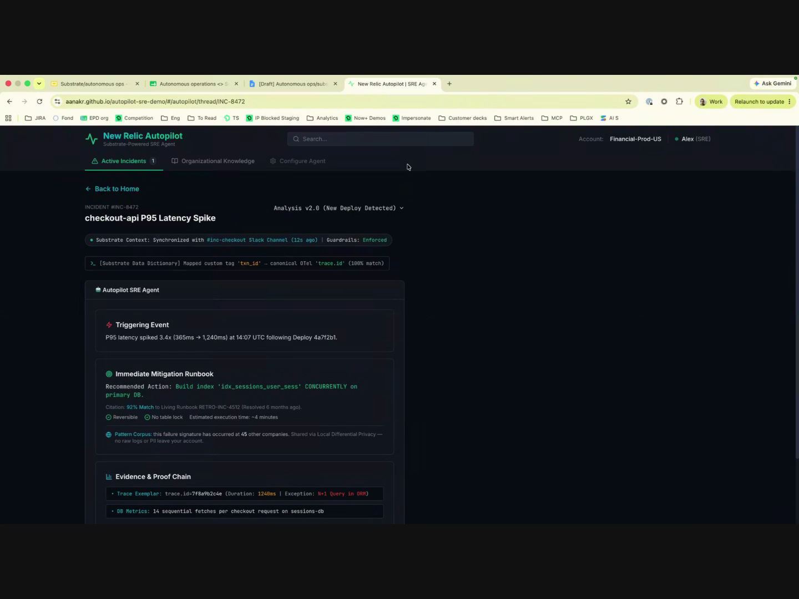
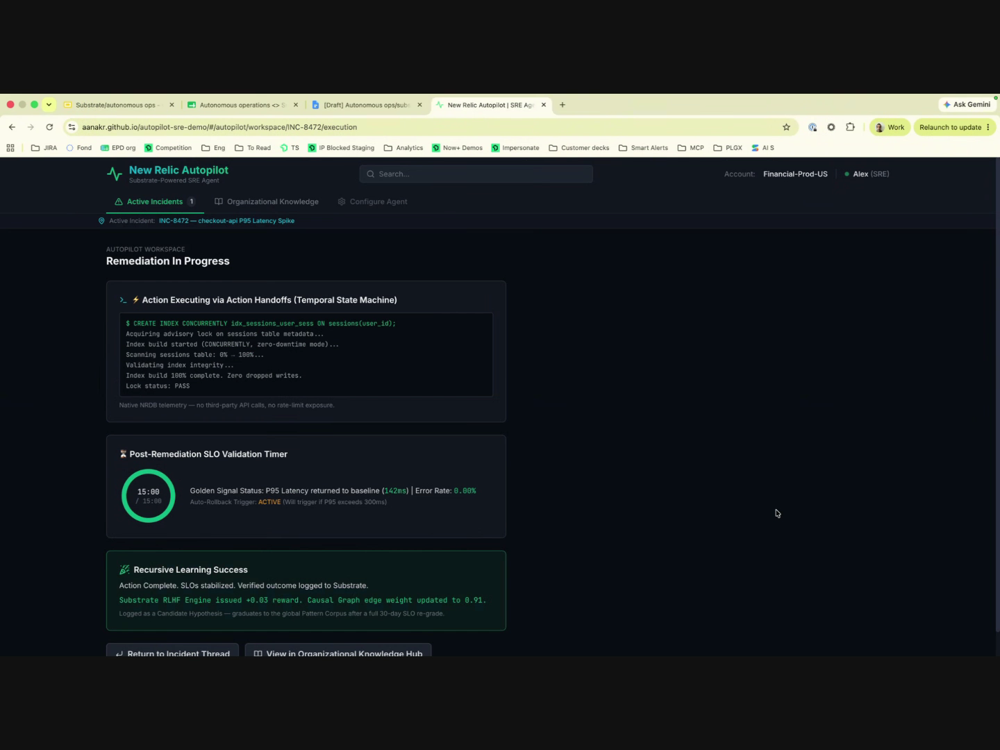
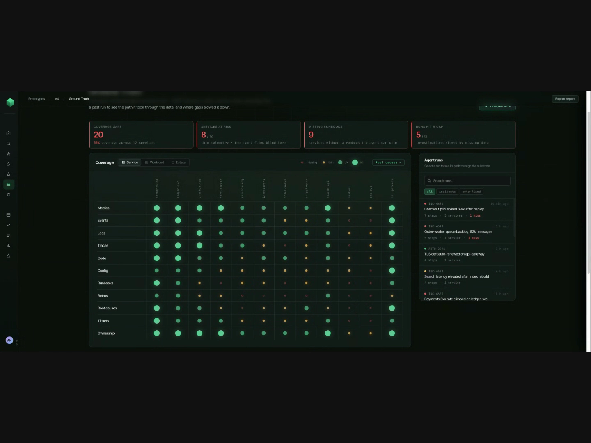
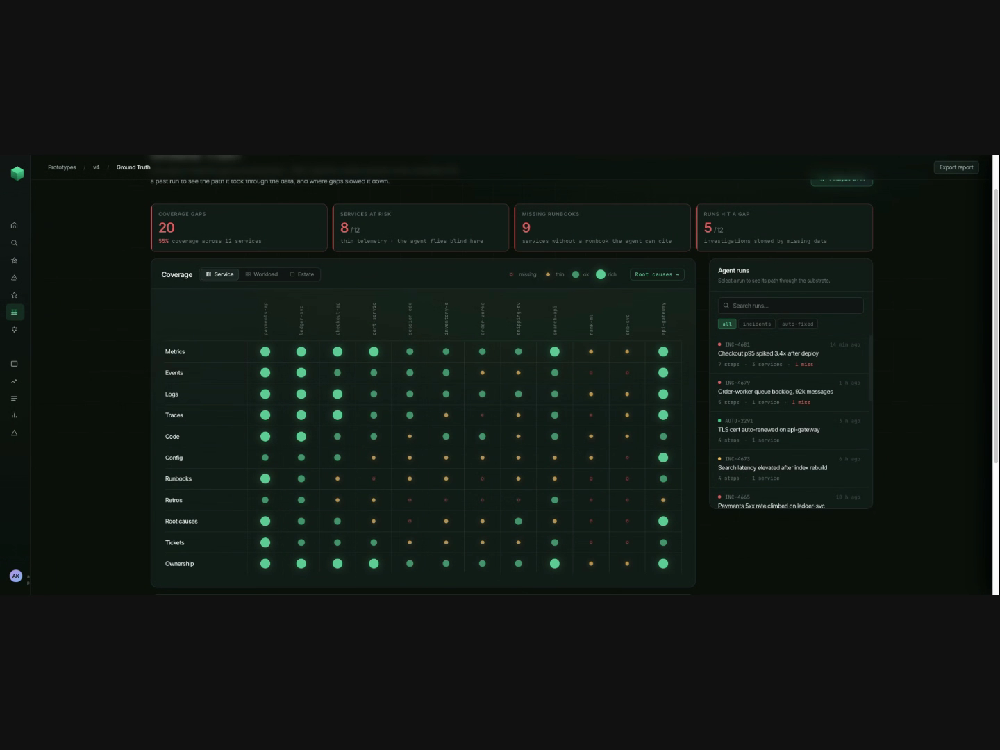
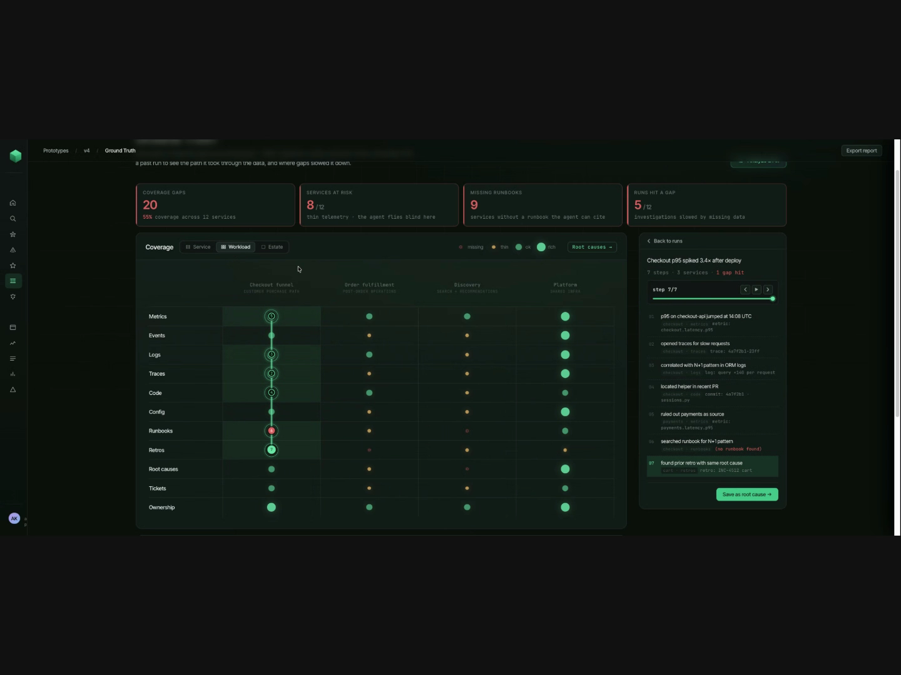
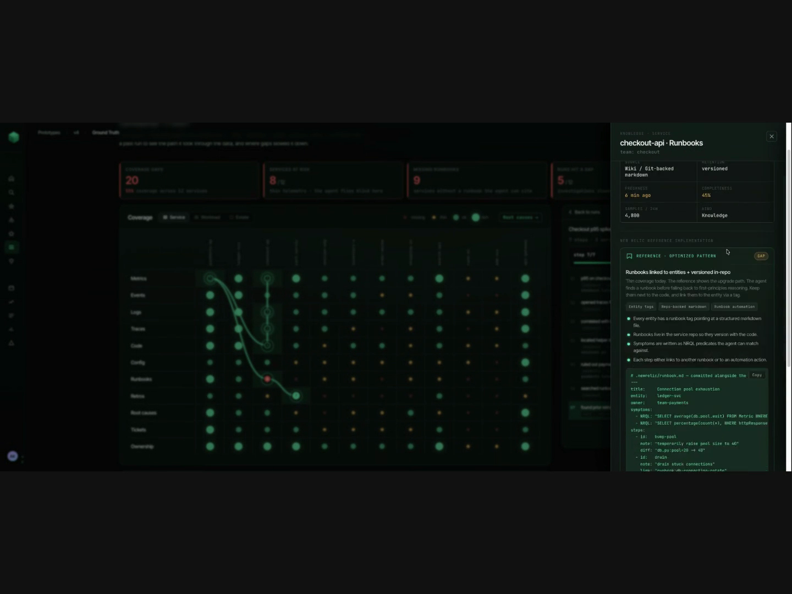
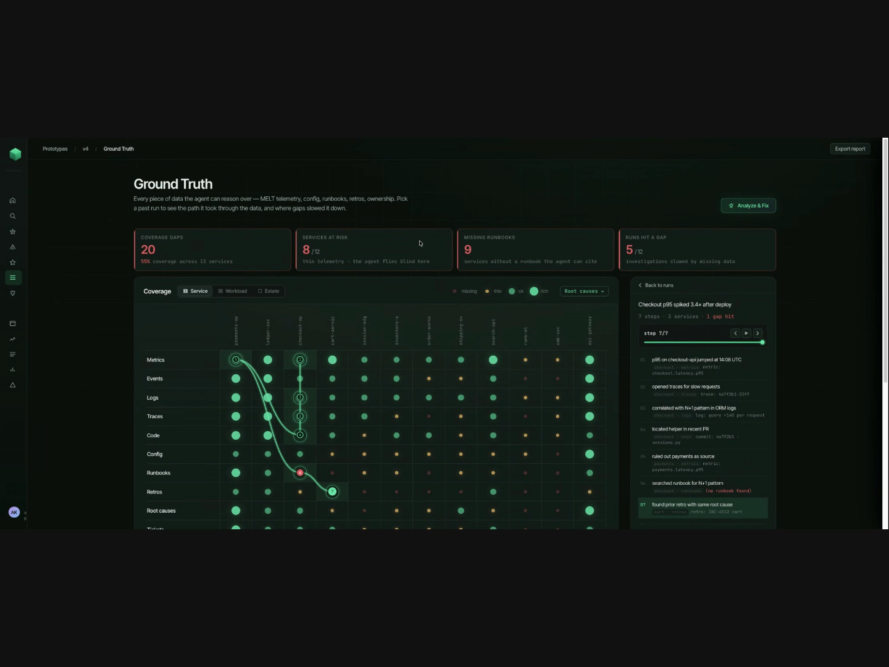
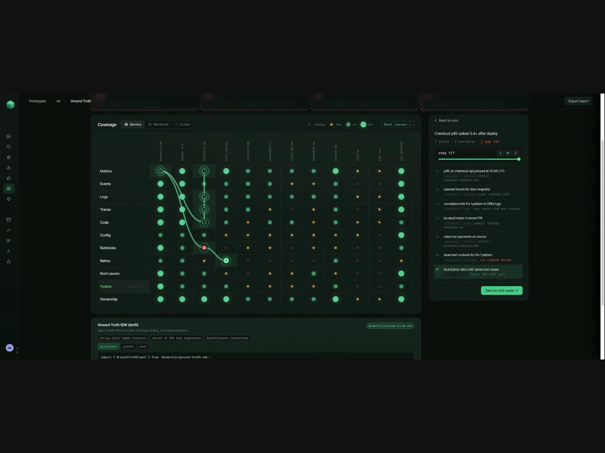

# Camden's v4 prototype — screen-by-screen reference

Source: "Ana & Camden - 2026/08/04 14:59 CDT - Recording.mp4" (in Downloads).
Camden shares his screen from roughly **1:02 to 10:39** into the call, demoing a
prototype hosted at `aanakr.github.io/autopilot-sre-demo` (breadcrumb reads
`Prototypes / v4 / Ground Truth`) — this looks like a newer iteration of the
same demo app in this repo. Screens below are pulled in the order they
appeared, cropped to exclude the webcam.

## 1. Incident detail — "checkout-api P95 Latency Spike" (~1:03)



Route: `/autopilot-sre-demo/#/thread/INC-8472`

- Header: **New Relic Autopilot** / "Substrate-Powered SRE Agent", tabs for
  **Active Incidents (1)**, **Organizational Knowledge**, **Configure Agent**.
- Incident title bar: `INCIDENT #INC-8472` / **checkout-api P95 Latency Spike**,
  with an "Analysis v2.0 (New Deploy Detected)" dropdown top-right.
- Status strip: "Substrate Context: Synchronized with `#inc-checkout` Slack
  Channel (12s ago) | Guardrails: Enforced", and a mono-font line below it:
  `[Substrate Data Dictionary] Mapped custom tag 'txn_id' → canonical OTel
  'trace.id' (100% match)`.
- **Autopilot SRE Agent** card, containing three stacked sub-cards:
  - **Triggering Event** — "P95 latency spiked 3.4x (365ms → 1,240ms) at
    14:07 UTC following Deploy 4a7f2b1."
  - **Immediate Mitigation Runbook** — recommended action text with an inline
    code snippet, a "92% Match to Living Runbook RETRO-INC-4512 (Resolved 6
    months ago)" citation, badges for "Reversible" / "No table lock" /
    "Estimated execution time: ~4 minutes", and a "Pattern Corpus" note about
    the failure signature occurring at 45 other companies via differential
    privacy.
  - **Evidence & Proof Chain** — trace exemplar and DB metrics bullet lines
    (scrolls further below the fold).

## 2. Remediation in progress (~2:00)



Route: `/autopilot-sre-demo/#/autopilot/workspace/INC-8472/execution`

Reached from screen 1 (presumably by clicking a "Remediate" action, off-screen
in the recording). New page header: "AUTOPILOT WORKSPACE / **Remediation In
Progress**", with a persistent breadcrumb bar above it: "Active Incident:
INC-8472 — checkout-api P95 Latency Spike".

Three stacked cards:
- **Action Executing via Action Handoffs (Temporal State Machine)** — a
  terminal-style block streaming lines (`$ CREATE INDEX CONCURRENTLY
  idx_sessions_user_sess ON sessions(user_id);`, lock/scan progress, "Lock
  status: PASS"), captioned "Native NRDB telemetry — no third-party API
  calls, no rate-limit exposure."
- **Post-Remediation SLO Validation Timer** — a circular countdown (shown at
  15:00 / 15:00) next to "Golden Signal Status: P95 Latency returned to
  baseline (142ms) | Error Rate: 0.00%" and "Auto-Rollback Trigger: ACTIVE
  (will trigger if P95 exceeds 300ms)".
- **Recursive Learning Success** (green-bordered) — "Action Complete. SLOs
  stabilized. Verified outcome logged to Substrate." / "Substrate RLHF Engine
  issued +0.03 reward. Causal Graph edge weight updated to 0.91." / "Logged as
  a Candidate Hypothesis — graduates to the global Pattern Corpus after a
  full 30-day SLO re-grade."
- Footer buttons: "Return to Incident Thread", "View in Organizational
  Knowledge Hub".

## 3. Ground Truth landing page (~2:47)



Route: `/autopilot-sre-demo/#/autopilot/...` (breadcrumb: `Prototypes / v4 /
Ground Truth`). This is where the demo pivots from a single-incident view to
a cross-service "ground truth" coverage tool. Left rail: a stack of nav icons
(home, search, star, alert-triangle, star, list, grid, chart-line, list,
bar-chart, alert-triangle), plus an avatar ("AK") pinned at the bottom.

- Top-right: **Export report** button.
- Four stat tiles: **Coverage Gaps: 20** (55% coverage across 12 services),
  **Services at Risk: 8/12** ("thin telemetry — the agent flies blind here"),
  **Missing Runbooks: 9** (services without a runbook the agent can cite),
  **Runs Hit a Gap: 5/12** (investigations slowed by missing data).
- **Coverage** panel (left, ~2/3 width) — a matrix: rows are data categories
  (Metrics, Events, Logs, Traces, Code, Config, Runbooks, Retros, Root causes,
  Tickets, Ownership), columns are services (payments-api, ledger-svc,
  checkout-api, cart-service, session-mgr, inventory-s, order-worker,
  shipping-sv, search-api, rank-ml, edu-svc, api-gateway). Each cell is a
  colored dot: **missing** (small red), **thin** (small amber), **ok**
  (mid green), **rich** (large green) — legend top-right of the panel, next
  to a **Root causes →** button. Tabs above the grid switch the column
  grouping: **Service** / **Workload** / **Estate**.
- **Agent runs** panel (right) — a search box ("Search runs...") with filter
  chips **all** / **incidents** / **auto-fixed**, then a list of past runs,
  each showing a status dot + ID + relative time (e.g. "INC-4681 · 14 min
  ago"), a one-line title ("Checkout p95 spiked 3.4x after deploy"), and a
  meta line ("7 steps · 3 services · 1 miss"). Five sample runs are visible.

## 4. Coverage matrix before selecting a run (~3:00)



Same page as screen 3, scrolled down slightly so the "Coverage" grid and the
right-hand panel (still showing the **Agent runs** list) sit under the sticky
header/stat-tile row. No investigation is selected yet — the matrix has no
path overlay. This is the "before" state; clicking a run in the Agent runs
list (e.g. "Checkout p95 spiked 3.4x after deploy") transitions to screen 8.

## 5. Coverage tab toggle: Service → Workload, with root-cause path (~3:50)



Same Coverage panel, but the **Workload** tab is now active instead of
**Service** — columns collapse from 12 individual services into 4 grouped
workloads: **Checkout funnel** (subtitle "customer purchase path"), **Order
fulfillment** ("post-order operations"), **Discovery** ("search +
recommendations"), **Platform** ("shared infra"). The root-cause path from
the selected run is overlaid on the "Checkout funnel" column, connecting
Metrics → Logs → Traces → Code → Runbooks (red "missing" node) → Retros
(green numbered endpoint "7"). This demonstrates the grid can be re-sliced by
grouping without losing the active investigation's path.

## 6. Runbooks knowledge drawer (~4:10)



Clicking the red "Runbooks" cell for `checkout-api` (visible mid-path in
screens 5/8) slides in a right-side drawer over the Coverage grid:

- Header: "KNOWLEDGE · SERVICE" / **checkout-api · Runbooks** / "team:
  checkout", with a close (×) button.
- A small key/value grid: Source: "Wiki / Git-backed markdown", Retention:
  "versioned", Freshness: "6 min ago", Completeness: "45%", Samples/24h:
  "4,800", RTO: "Knowledge".
- **NEW RELIC REFERENCE IMPLEMENTATION** card with a "GAP" badge:
  - "REFERENCE · OPTIMIZED PATTERN" / **Runbooks linked to entities +
    versioned in-repo**, with body copy: "Thin coverage today. The reference
    shows the upgrade path. The agent finds a runbook before falling back to
    first-principles reasoning. Keep them next to the code, and link them to
    the entity via a tag."
  - Tag pills: "Entity tags", "Repo-backed markdown", "Runbook automation".
  - Four checklist bullets (runbook tag on every entity, runbooks versioned
    with the code, symptoms as NRQL predicates, each step links to another
    runbook or an automation action).
  - A YAML code block (`.newrelic/runbook.md`) with a **Copy** button, showing
    a sample runbook: title, entity, owner, symptoms (NRQL queries), and
    steps (`bump-pool`, `drain`, ...) with diffs/links.

## 7. "Ground Truth" page, scrolled to top / hero (~5:50)



Scrolling to the very top of the same page reveals a hero section that sits
above the stat tiles (not visible in screens 3/4/5, which were mid-scroll):

- Breadcrumb: `Prototypes / v4 / Ground Truth`, **Export report** button.
- **H1: "Ground Truth"**, subhead: "Every piece of data the agent can reason
  over — MELT telemetry, config, runbooks, retros, ownership. Pick a past run
  to see the path it took through the data, and where gaps slowed it down."
- A primary button, top-right of the hero: **"Analyze & Fix"**.
- Below: the same four stat tiles and Coverage matrix from screen 3, with the
  "Checkout p95 spiked 3.4x after deploy" run already selected (path drawn,
  right panel mid-step-log).

## 8. Full investigation replay + Ground Truth SDK section (~5:00–10:39, static)



This is the steady-state screen Camden leaves up for most of the demo (from
roughly 3:10 to 10:39, i.e. the bulk of the walkthrough) — worth treating as
the primary "hero" screen to rebuild first.

- **Coverage** grid with the full root-cause path drawn end-to-end: Metrics →
  Logs → Traces → Code (all on `checkout-api`) → Runbooks (red, "missing") →
  Retros (green circled "7", the resolution node). Path nodes are small
  circled dots along the line; hovering/selecting seems to pop the "Runbooks"
  drawer from screen 6.
- **Right panel — run detail**: "← Back to runs" link; run title "Checkout
  p95 spiked 3.4x after deploy"; meta line "7 steps · 3 services · **1 gap
  hit**" (the "1 gap hit" appears styled as a warning); a **step 7/7**
  scrubber with prev/play/next transport controls and a filled progress bar;
  a numbered step log (7 entries), each with a bold action line and a
  dimmed detail line, e.g.:
  1. "p95 on checkout-api jumped at 14:08 UTC" — `checkout · metrics ·
     metric: checkout.latency.p95`
  2. "opened traces for slow requests" — `checkout · traces · trace:
     4a7f2b1-23ff`
  3. "correlated with N+1 pattern in ORM logs" — `checkout · logs · log:
     query >140 per request`
  4. "located helper in recent PR" — `checkout · code · commit: 4a7f2b1 ·
     sessions.py`
  5. "ruled out payments as source" — `payments · metrics · metric:
     payments.latency.p95`
  6. "searched runbook for N+1 pattern" — `checkout · runbooks` **(no
     runbook found)**
  7. "found prior retro with same root cause" (highlighted/selected row) —
     `cart · retros · retro: INC-4512 cart`
  - Footer button: **"Save as root cause →"**.
- Scrolling the left column down reveals a **"Ground Truth SDK (draft)"**
  card below the matrix: title + description ("Agent-grade APIs for proofs,
  coverage ranking, and replay evaluation."), a package badge
  `@newrelic/ground-truth-sdk`, tag pills ("Stripe-style typed resources",
  "Vercel AI SDK tool ergonomics", "OpenTelemetry conventions"), sub-tabs
  **quickstart** / **proofs** / **eval**, and (under quickstart) a code
  sample starting `import { GroundTruthClient } from
  '@newrelic/ground-truth-sdk';`.

## Flow summary

```
Incident detail (1)
  → Remediation in progress (2)
    → [switch context] Ground Truth landing, Agent runs list (3)
      → select a run → Coverage before/after (4) → (8)
      → toggle Service/Workload/Estate tabs (5)
      → click a gap cell → Runbooks knowledge drawer (6)
      → scroll to top → hero + CTA "Analyze & Fix" (7)
      → scroll down on (8) → Ground Truth SDK card (quickstart/proofs/eval)
```

Not captured (didn't occur in the recording): clicking "Analyze & Fix",
"Export report", the "Estate" tab, or the "proofs"/"eval" SDK sub-tabs — the
screen share ends at 10:39 and the rest of the call is whiteboard discussion.
